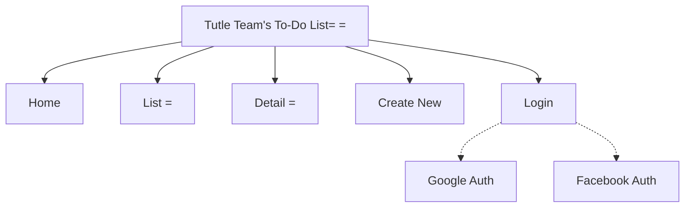

# Turtle Team's To-Do List

###### Tyler Zars, Cameron Miskell, Grant Butler

# Table of Contents

[TOC]

### Project Overview

Our website aims to allow users to create to-do lists, focusing hard on ease of use. Our target market is towards anyone who finds it difficult to keep track of what they need to get done, and we hope to improve their day to day life with our product.

#### Requirements

##### Pages

This website had the requirements of having four pages:
- Home
- To-Do List
- Task Detail
- Create Task

##### Routing

Our website needed to be configured using the `react-router` NodeJS package, which allowed us to move our different pages and components.

#### Using Hooks and API

##### Model

The data model of each task follows:
1. taskID
2. Task Name
3. Task List Topic
4. categoryID
5. datetime
6. status

Using hooks, we are able to fetch and store data with the Firebase API. This allows our users to save their information with their logins.

##### Login

Our application is able to allow users to log in and store their data with several different authentication services, including:

###### Firebase Authentication

Using Google's Firebase, we were able to get the login to use the user's Google Auth. This allows the user to save their information as they add to their to-do list.

###### Facebook Login

Our website is also able to allow you to log in using the Facebook Auth, allowing users to choose to sign in with that.

### Site Map

### Page Design

#### Pages

##### Home

- Purpose: to welcome people to the site
- Audience: prospective and current users of the site
- Data: (n/a)
- Validations: (n/a)
- Buttons: navbar to other parts of the site

##### List

- Purpose: show the to-do list of a user, or what a list could look like
- Audience: prospective and current users
- Data: example list or a user's current list on the Firebase DB
- Validations: connection with hooks to Firebase API
- Buttons: navbar, `Delete` and `Detail` for each task

##### Details

- Purpose: show all details of a specific entry on the list
- Audience: logged-in users
- Data: information regarding a current entry on a list
- Validations: hooks to Firebase
- Buttons: navbar, `Add updated task to list!`, `Return to list`

##### Create New

- Purpose: create a new entry on the to-do list of a given user
- Audience: logged-in users
- Data: new task information to be added
- Validations: connects to Firebase DB implementation to store the new task for a user
- Buttons: navbar, `Submit Query`

##### Login

- Purpose: to let a user log in using either username/password, Google auth, or Facebook auth
- Audience: current or new users
- Data: username/password of a user
- Validations: connection to Firebase for storage of information
- Buttons: `Sign In`, `Sign Up`, `Sign in with Google`, `Facebook Pop Up`

### Challenges Faced

Throughout this project, some big issues faced were definitely with communication from our instructor about how some features were to be implemented. Specifically in Milestone 2, the implementation of the `DB` module and saving the information with hooks without a database to send/fetch data to and from. Alongside that, figuring out some of the different hooks and getting the project to connect with Firebase API was a challenge, yet was quite rewarding as an experience.

### Future Plans

In the future, we would like to work on the overall cleanness of the website using CSS, along with adding new functionality like export/import to CSV, as well as the ability to have multiple different lists. Push notifications and deadlines would help to make it easier to remind users of their tasks.